# CS546-Final-Project
Project for CS546 

beta - functional source

NEVER include node_modules or package-lock.json in src

must run: 

- npm install
- npm start

# Group Name: 
Group 43

# Group Members:
- Jamie Shamilian
- Caitlin Carbone
- Edward Kashulsky
- Cindy Tran

# Developers Log
Jamie Shamilian 

- created the structure
- Started with Lab 10 login ....
- created "views/pages" with handlebars
- implemented login using login,logout,signup,auth
- added profile page via profile.handlebars
- added routes/profile.js to supprot prrofile page
- added data/users.js to support login/profile pages

TODO:
developer

- choose page to implement.
- create/update handlebars page
- create/update routes/PAGE.js
- create/update data/dbPAGE.js

TODO pages found after login.....

- Click Here to edit Profile --- initial handlebars / routes / data Done -- needs input checks, validation 
- Click Here to add a Payment -- initial handlebars done / routes / data --- needs cleanup and validation....
- Click Here to add a Pet  -- initial handlebars routes / data done.... needs update and delete functions 
- Click Here to search for a Pet -- initial handlebars routes / data done
	-if user is admin call updatePet -- initial handlebars routes / data done
	-if user other call selectPet to order  -- initial handlebars routes / data done
		- select Pet to purchase with payment method -- initial handlebars routes / data done
	-select orders to show -- initial handlebars routes / data done
		- show order  -- initial handlebars routes / data done
- Click Here to show Orders   -- initial handlebars routes / data done
- Added encryption to credit card number 

Screen Shots:

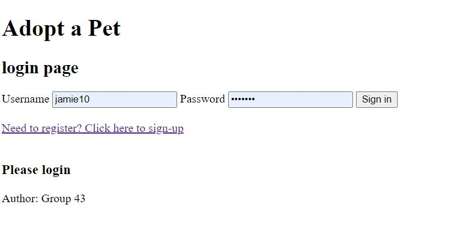

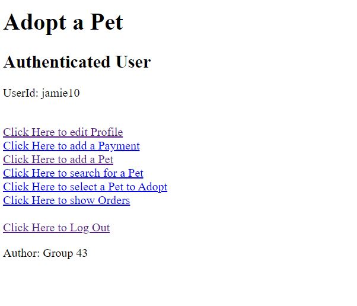

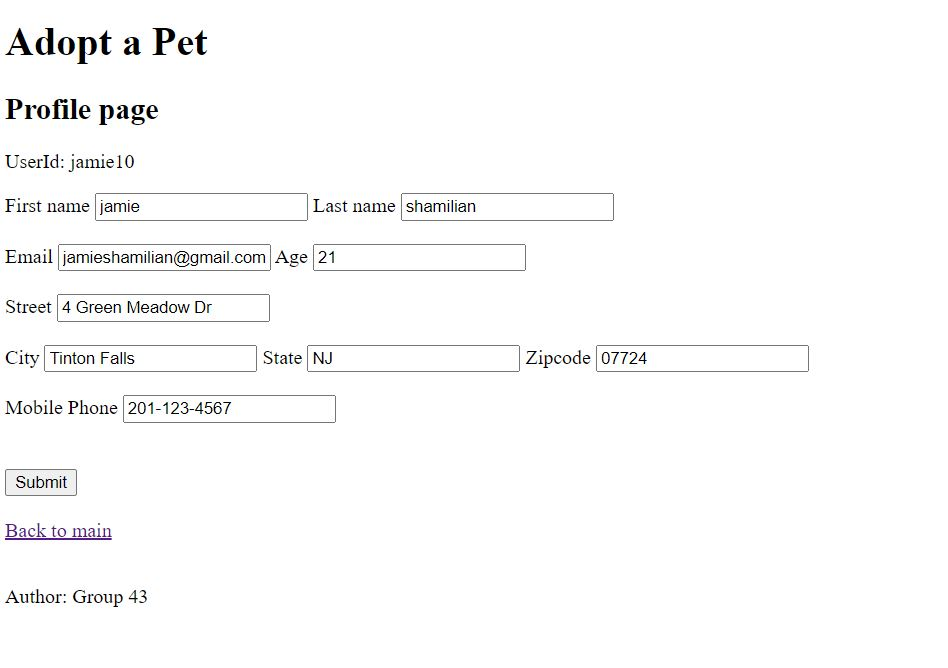

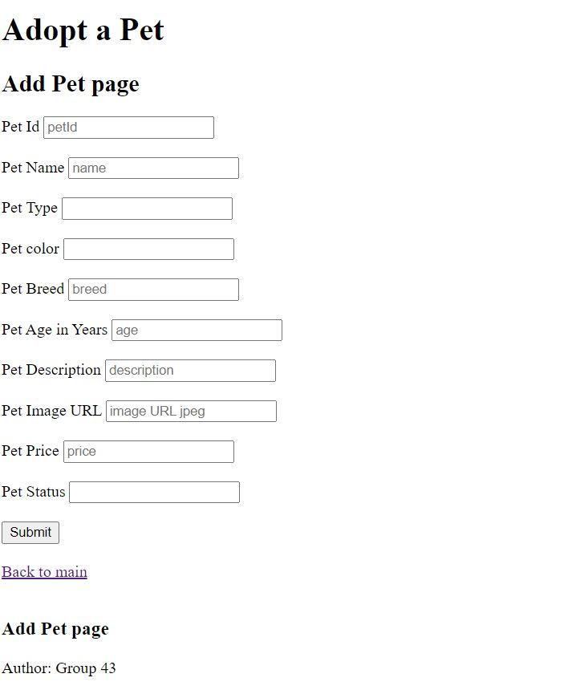

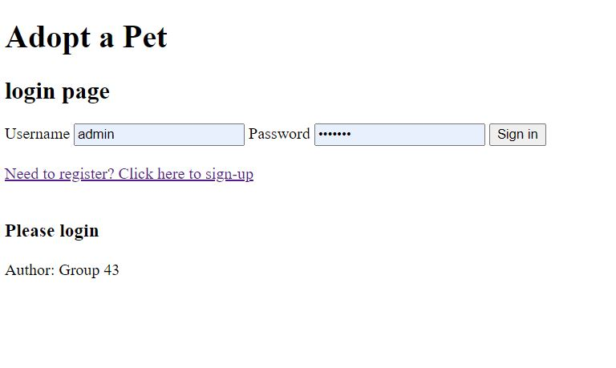

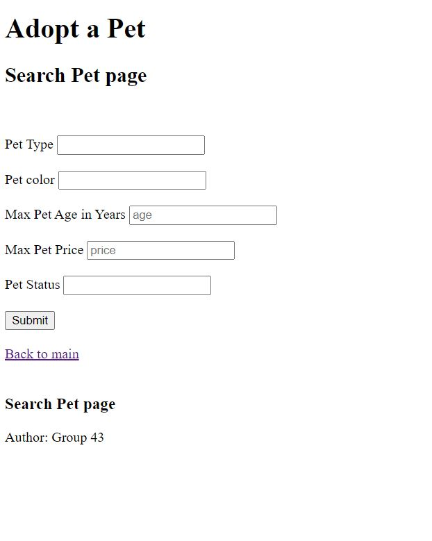

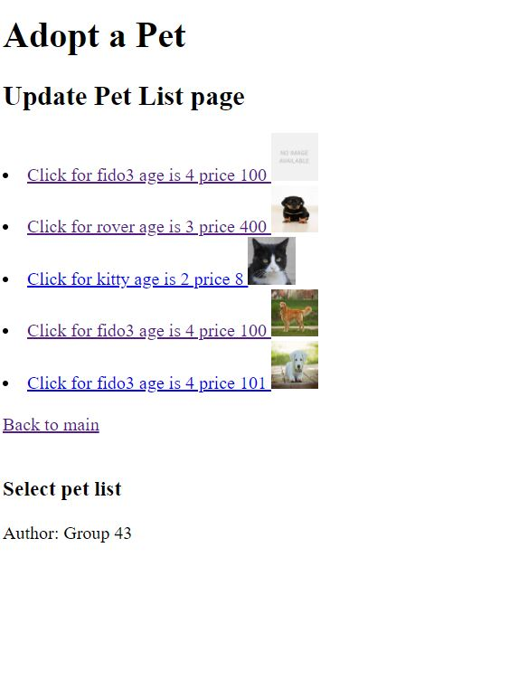

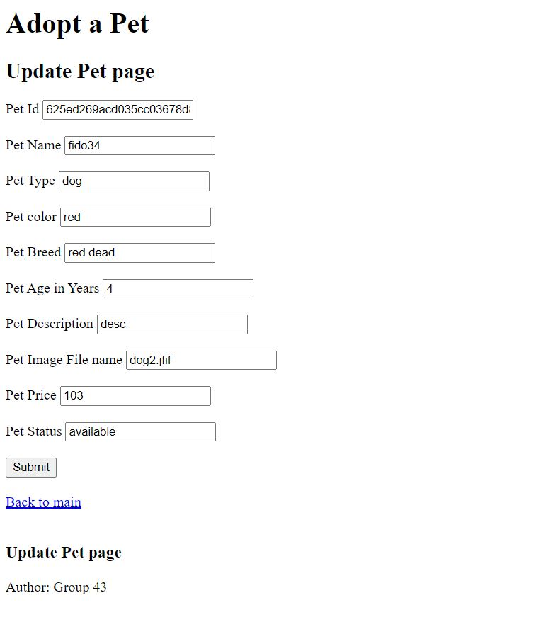

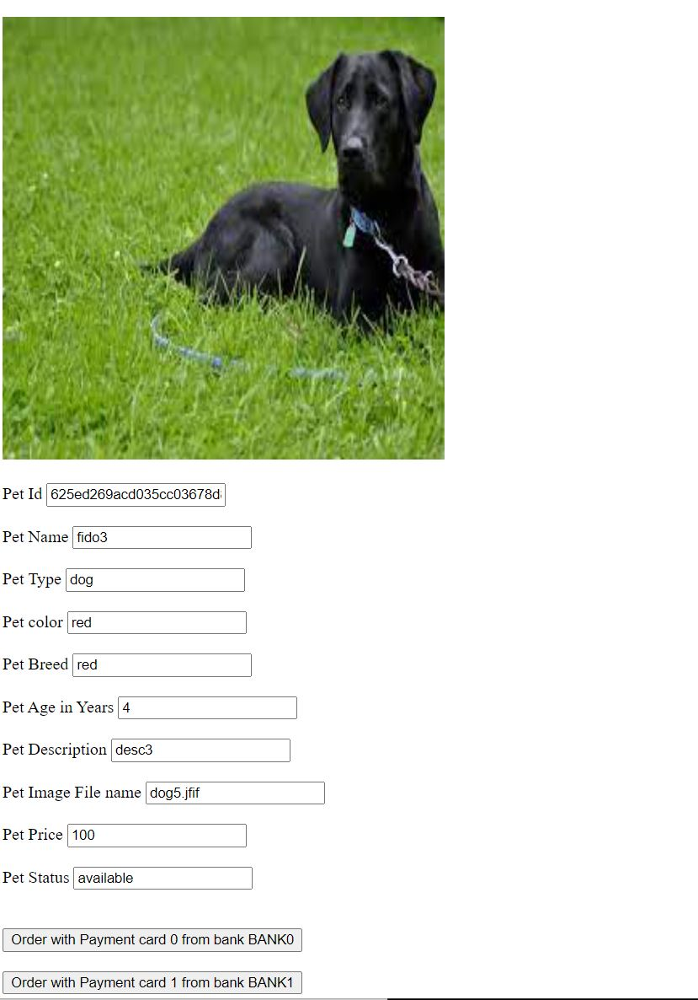

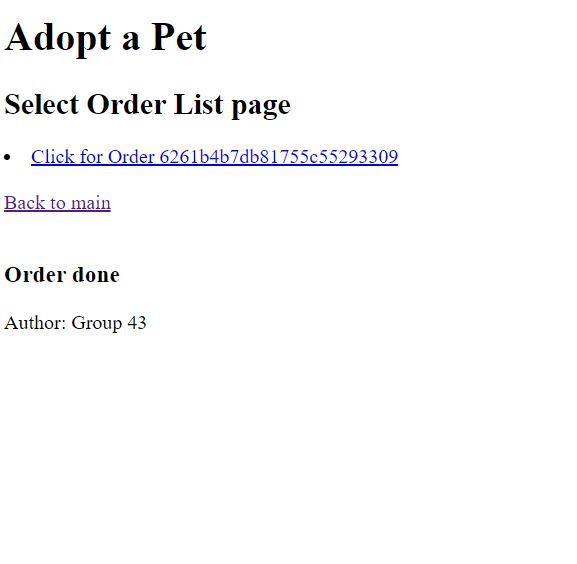

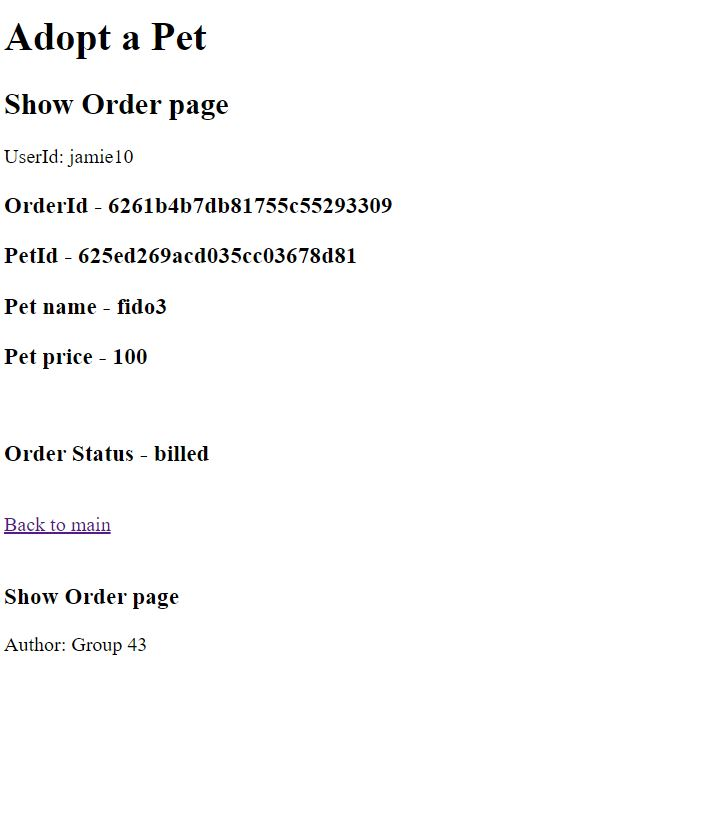

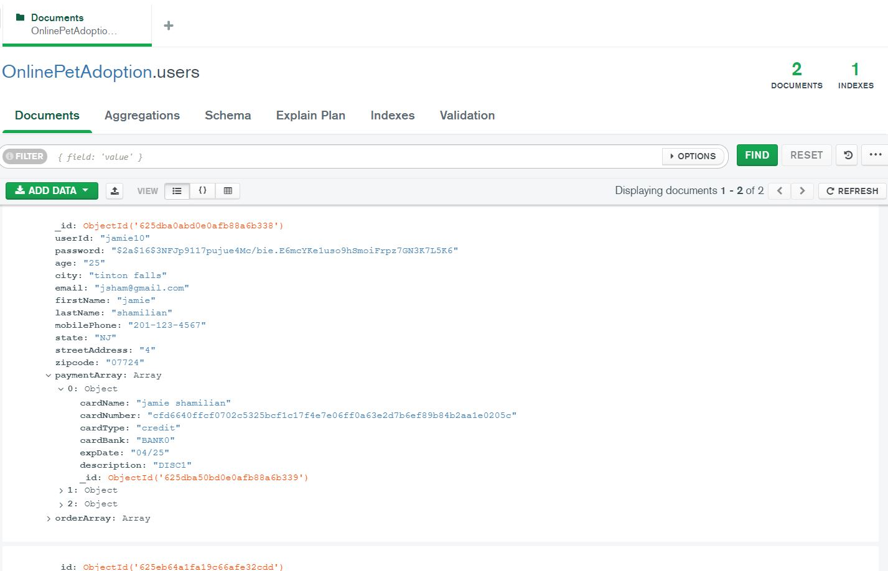
