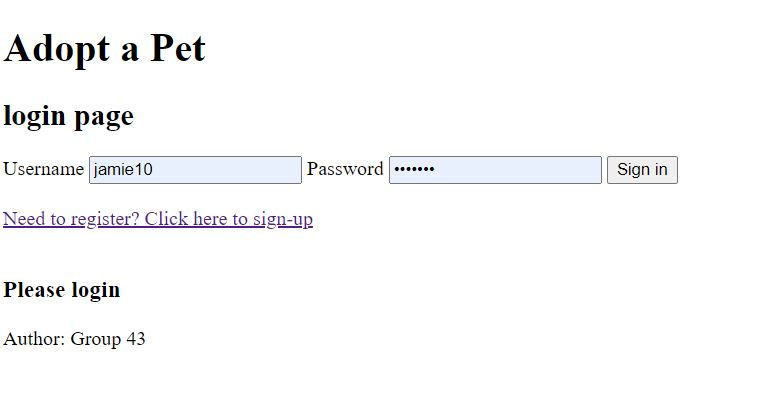
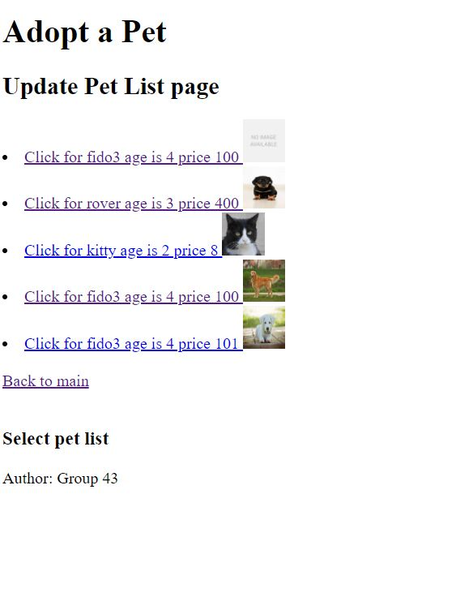
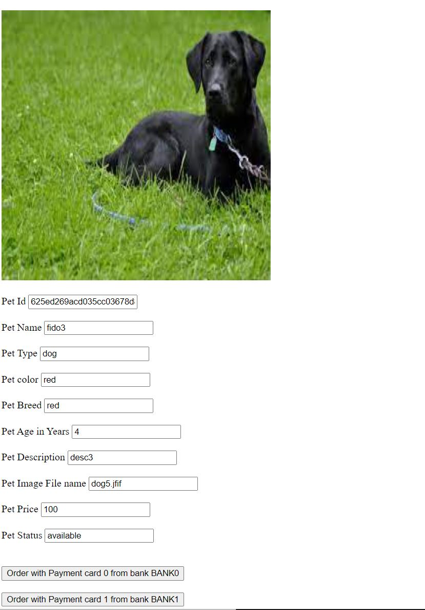

# CS546-Final-Project
Project for CS546 

release - complete functional source 

# Group Name: 
Group 43

# Group Members:
- Jamie Shamilian
- Caitlin Carbone
- Edward Kashulsky
- Cindy Tran

# installation instructions
# installation instructions
- download src from github
- choose version you want to user example release
- make sure mongo is installed and running

# instructions for release only
- from shell npm install
- from shell npm run seed ( creates users admin, jamie10, fills profile, fills payments ... )   
- from shell npm start
  - from shell npm start alt ( alternate sign-up page with profile)

# running instructions manual
- From browser open http://localhost:3000 
- Create a normal user using the sign-up option at login screen
  - if alt signup create normal user with all profile info
- login as normal user ( example jamie10 password jamie10 )
- fill out your profile
- add payment methods
- search for pets to purchase (fill in via pull downs, only fields you want to restrict) 
- browse all pets
- select pet to purchase
- add pet to favorite
- like pet
- show favorites
- comment on pets
- order pet with payment button
- view your order 

# admin instructions
- login as admin password admin10
- add Pet to create and new pet entry (file images must be copied to public/images seperately)
- search for pet to update info
- show ( and change status of ) orders for all users

# Developers Log
Jamie Shamilian 

- created the structure
- Started with Lab 10 login ....
- created "views/pages" with handlebars
- implemented login using login,logout,signup,auth
- added profile page via profile.handlebars
- added routes/profile.js to supprot prrofile page
- added data/users.js to support login/profile pages
- added data/payments.js to support credit card transactions
- added data/pets.js to support searching lists of pets
- added data/orders.js to support orders to purchase pets
- added likes
- added favorites
- added comments
- added alternate signup page ** filling profile info during signup WHICH is bad design.
  - In order to use this version start with "npm start alt"

TODO:
developer

- choose page to implement.
- create/update views/pages/handlebars page
- create/update routes/PAGE.js
- create/update data/dbPAGE.js

TODO pages found after login.....

- Click Here to edit Profile --- initial handlebars / routes / data Done -- needs input checks, validation 
- Click Here to add a Payment -- initial handlebars done / routes / data --- needs cleanup and validation....
- Click Here to add a Pet - admin only  -- initial handlebars routes / data done.... needs update and delete functions 
- Click Here to search for a Pet -- initial handlebars routes / data done
	-if user is admin call updatePet -- initial handlebars routes / data done
	-if user other call selectPet to order  -- initial handlebars routes / data done
		- select Pet to purchase with payment method -- initial handlebars routes / data done
	-select orders to show -- initial handlebars routes / data done
		- show order  -- initial handlebars routes / data done
- Click Here to show Orders   -- initial handlebars routes / data done
- Added encryption to credit card number 
- added validations for all needed inputs
- added orders view for admin
- admin can change status of order
- seed.js can init the DB

Screen Shots:

